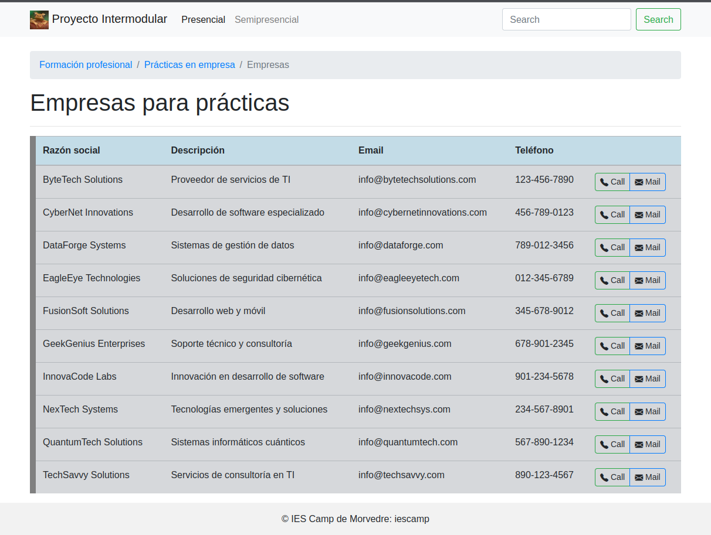

> Para evitar dependencias se ha mejorado el despliegue del proyecto utilizando [docker](https://www.docker.com/) y [docker-compose](https://docs.docker.com/compose/). Puedes ver el proyecto actualizado en [jrpellicer/proyectoasir](https://github.com/jrpellicer/proyectoasir) o [guilleatm/proyecto-asir](https://github.com/guilleatm/proyecto-asir).

# Instalación
Para que el proyecto funcione necesitamos tener una base de datos operativa, hemos preparado una SQLite ya que almacena los datos en un fichero de texto plano.

* Instalamos PHP `apt-get install php`
* Instalamos SQLite `apt-get install sqlite3`
* Instalamos módulo SQLite de PHP `apt-get install php-sqlite3`
* Editamos configuración PHP `nano /etc/php/{version}/apache2/php.ini` descomentamos la línea `extension=pdo_sqlite` para habilitar el módulo.

# Ejecución
Podemos ejecutar nuestro servidor web desde el propio VS Code utilizando los plugins [Live Server](https://marketplace.visualstudio.com/items?itemName=ritwickdey.LiveServer) (ritwickdey.LiveServer) y [PHP Server](https://marketplace.visualstudio.com/items?itemName=brapifra.phpserver) (brapifra.phpserver)

> Proyecto base: https://github.com/jrpellicer/proyectoasir

